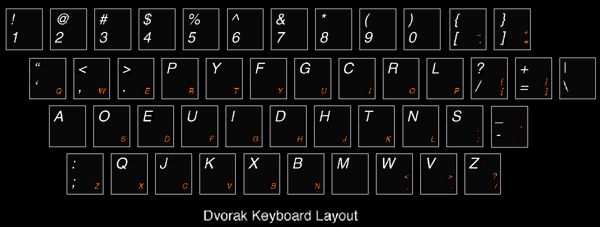

# javaScript.typingTest

I wanted a simple website that would help me drill and get comfortable typing, reading, and working with javascript.

Edition Game Plan:
----------------

*This will most likely change*

1. Make it work with quotes
2. Add the strings for code
3. Add strings to explain the elements I'm typing, like flashcards.

*I will likely add code snippits as I find them*

- I want to focus on the "top 1000 most common" at first
- This will be adaptable for other languages
- Will be a living library of common syntactic sugar cubes

*The inspiration was figuring out how to output code like this:*

if (typedChar == null) {
    char.classList.remove('correct_char');
    char.classList.remove('incorrect_char');

Wink wink:
---------------

*You're keyboard, your choice!*

<figure>

<figcaption>Feel special, type with Dvorak!!</figcaption>
</figure>

Start with [monkeype][1], brush up on problem areas with [The Practice Test][2], and [hard-mode][3] if you just want results and plan on having fun later.

Still practicing with markdown, so I am still shamelessly adding unnecessary parts to this file.
That's why it looks so **AWESOME**.

[1]: http://www.monkeytype.com/ "MonkeyType"
[2]: http://thepracticetest.com/  "The Practice Test"
[3]: http://climech.github.io/typing-practice/  "Programmers Typing Practice"